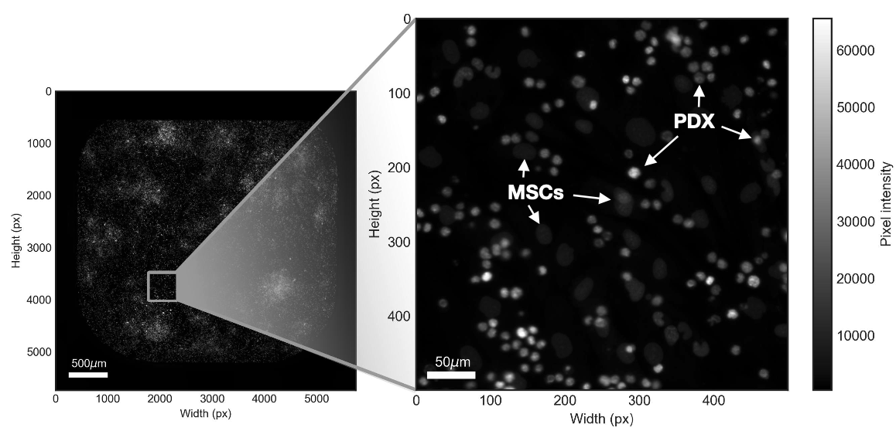
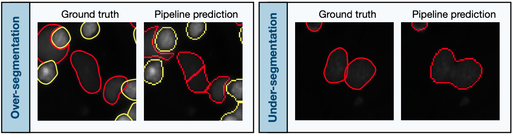

# A non-informatics approach to co-culture high-content image analysis using supervised machine learning
Microscopy images from high-content screening (HCS) experiments afford new dimensions of phenotypic information by extracting quantitative multi-parametric data at the single-cell level. However, the approach to analysis of such rich datasets can be challenging without programming experience. Furthermore, co-culture biological models add a requirement for discrimination between different cell types within a single image.

This image analysis protocol aims to provide a basic skeleton pipeline which can accurately and precisely identify and quantify two cell types within a single image using a Random Forest machine learning model in two open source applications, with no programming or computational experience required. Additional modules can be added to extract further information as desired, such as measures of size, shape, and intensity. For example, extraction of nuclei intensity to determine cell cycle staging of individual cells as described by <i>Roukos et al.</i> ([10.1038/nprot.2015.016](https://doi.org/10.1038/nprot.2015.016)). The pipeline can also be operated in headless mode should there be a requirement for use with high performance computing to increase computational throughput.

This example pipeline uses images from patient-derived xenograft (PDX) acute leukemia cells (AML/ALL) in co-culture with human bone marrow-derived mesenchymal stem cells (MSCs). The images are raw grayscale TIF images of cells assayed across a wide range of experimental conditions and live cells stained with the nucleic acid dye CyQUANT (<i>cat #C35011, ThermoFisher Scientific</i>). 



> ***Note*** In principle, any fluorescence microscope with a stable illumunation source that can acquire images of DNA stained cells can be used for this analysis pipeline. Appropriate high-content imaging systems include the  Zeiss CellDiscoverer 7 and the PerkinElmer Opera.

## Contents
* ```Requirements.txt``` contains the required open source applications used throughout the workflow.
* [```ExampleProject.ilp```](ExampleProject.ilp) is a pre-trained Ilastik project used to generate probability maps of unseen data sets (semantic segmentation).
* [```ExampleProject.cppipe```](ExampleProject.cppipe) is an example skeleton analysis pipeline for CellProfiler used to identify and quantify respective cell types (instance segmentation).
* [training_dataset/...](training_dataset/) contains example cropped images which can be used to train the machine learning classifier in the ```ExampleProject.ilp``` project.
* [test_dataset/...](test_dataset/) contains example cropped images which can be used to test the performance of the trained model on these unseen images.
  * [```test_dataset/groundtruth_values.csv```](test_dataset/groundtruth_values.csv) contains the ground truth absolute counts for the test dataset images.
  * [test_dataset/probabilities/...](test_dataset/probabilities) contains pre-generated probability maps which can be used in the ```ExampleProject.cppipe``` pipeline.
* [```BaseProject.ilp```](BaseProject.ilp) is a foundational Ilastik project which can be used to generate semantic segmentation probability maps from training data.
* [```BaseProject.cppipe```](BaseProject.cppipe) is a skeleton analysis pipeline for CellProfiler used to identify and quantify respective cell types (instance segmentation).
## Getting Started
Using high-quality fluorescence microscopy images of stained nuclei in TIF format:
1. Manually train a supervised machine learning model using the ```BaseProject.ilp``` Ilastik project and export the probability maps (semantic segmentation);
2. Process the generated probability maps using the ```BaseProject.cppipe``` Cell Profiler pipeline to estimate absolute cell counts for each respective cell type (instance segmentation);
3. Export the absolute cell counts from the generated database file for downstream statistical analyses.

The ```ExampleProject.ilp``` and ```ExampleProject.cppipe``` files can be used to view a pipeline which is trained on the training image dataset and applied to the unseen test image dataset. Object-level performance of the model can be assessed using the ground truth values of the test dataset (See below). 

Walkthrough instructions are provided in a full protocol at [10.17504/protocols.io.rm7vzxy52gx1/v1](https://dx.doi.org/10.17504/protocols.io.rm7vzxy52gx1/v1).

## Performance and validation 
Object-level performance of the pipeline can be used by applying a trained model on the unseen test data set and comparing the outputted absolute cell counts to the ground truth values reported.

Performance of the Example Pipeline trained on the training dataset and applied to the unseen test dataset is illustrated in the table.

| Image Name        | PDX Ground Truth | PDX Pipeline Prediction (ExampleProject) | MSC Ground Truth | MSC Pipeline Prediction (ExampleProject) |
|-------------------|------------------|------------------------------------------|------------------|------------------------------------------|
| `test_image_01.tif` | 1339             | 1360                                     | 683              | 504                                      |
| `test_image_02.tif` | 416              | 430                                      | 608              | 578                                      |
| `test_image_03.tif` | 1244             | 1141                                     | 523              | 482                                      |
| `test_image_04.tif` | 0                | 0                                        | 59               | 65                                       |
| `test_image_05.tif` | 260              | 234                                      | 493              | 464                                      |
| `test_image_06.tif` | 1070             | 889                                      | 642              | 521                                      |
| `test_image_07.tif` | 1441             | 1460                                     | 578              | 455                                      |
| `test_image_08.tif` | 455              | 433                                      | 620              | 620                                      |
| `test_image_09.tif` | 2049             | 2148                                     | 1042             | 721                                      |
| `test_image_10.tif` | 106              | 142                                      | 156              | 110                                      |
| `test_image_11.tif` | 897              | 790                                      | 524              | 441                                      |
| `test_image_12.tif` | 1898             | 1870                                     | 807              | 615                                      |
| `test_image_13.tif` | 561              | 553                                      | 585              | 458                                      |
| `test_image_14.tif` | 0                | 0                                        | 47               | 77                                       |

Accuracy and precision are high, but not perfect. Known object-level pipeline segmentation errors which can lead to over or under estimations of absolute cell counts for each cell type include over- and -under segmentation, respectively.



*(Left) The single, central MSC is inappropriately over- segmented into two individual MSC nuclei by the image-analysis pipeline, leading to an over-estimation of cell numbers. (Right) Two distinct but overlapping MSC nuclei are inappropriately merged into a single MSC nucleus, leading to an under-estimation of cell numbers. Red, MSC prediction; Yellow, PDX cell prediction.*

## Tips
* Avoid over-annotating the training dataset in Ilastik as this will result in poorer performance on unseen image data sets since the model will learn characteristics of the test data set and compromise generalisability of the model.
* Use several different images for annotation which represent different experimental conditions (i.e. untreated/negative control, positive control/complete cell death, intermediate cell numbers).
* The machine learning classifier type can be changed to several other models available in the python `scikit-learn` package. In Ilastik, navigate to *Advanced > Classifier...*
## Dependencies
This skeleton image analysis pipeline requires two open-source software applications which are available for Microsoft Windows and macOS (tested version provided in parentheses):
* [CellProfiler](https://github.com/CellProfiler) (4.0).
* [Ilastik](https://github.com/ilastik/ilastik) (1.3)

Each application may have additional dependencies, including Python version 3.7.

The pipeline can be operated on a standard desktop computer and does not require any high-performance computing systems (*see requirements of respective software applications*), though processing time will be increased on more powerful systems. 

## Disclaimers
Not intended for medical purposes. This protocol is not intended to diagnose or treat any medical condition and should not be used for any medical purpose. This protocol is intended for use only in a research capacity.

The author/s accept no responsibility for the accuracy of data resulting from this protocol. The author/s further assume no responsibility or liability for any errors or omissions in the content of this protocol. The information contained in this protocol is provided on an "as is" basis with no guarantees of completeness, accuracy, usefulness or timeliness and without any warranties of any kind whatsoever, express or implied.
